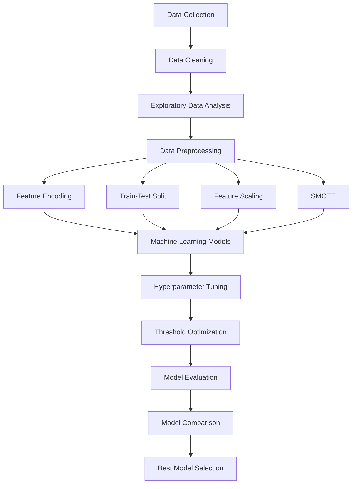

## **PROJECT OVERVIEW**

Financial institutions face significant financial losses when customers fail to repay their loans. Accurately predicting loan default enables banks to make informed lending decisions, minimize credit risk, and improve overall portfolio management.

This project develops and compares multiple machine learning classification models to predict whether a customer is likely to default on a loan using the Default of Credit Card Clients dataset. The project follows a complete data science workflow, including data cleaning, exploratory data analysis (EDA), data preprocessing, model development, hyperparameter tuning, model evaluation, and model comparison.

The final model provides a data-driven approach that can support credit risk assessment and assist financial institutions in identifying high-risk customers before loan approval.

## **BUSINESS PROBLEM**

Banks and lending institutions lose substantial amounts of money due to loan defaults. Traditional credit assessment methods may not always identify high-risk customers effectively.

The objective of this project is to build a machine learning model capable of predicting whether a customer will default on a loan based on their demographic information, credit limit, repayment history, bill statements, and previous payment records.

## **OBJECTIVES**

- Perform data cleaning and preprocessing.

- Conduct Exploratory Data Analysis (EDA) to understand customer behaviour.

- Handle class imbalance using SMOTE.

- Build multiple machine learning classification models.

- Tune model hyperparameters to improve performance.

- Compare model performance using appropriate evaluation metrics.

- Select the best-performing model for loan default prediction.


## **DATASET**


Dataset: Default of Credit Card Clients

The dataset contains customer information such as:

- Credit Limit (LIMIT_BAL)

- Gender (SEX)

- Education Level

- Marital Status

- Age

- Repayment Status (PAY_SEP – PAY_APR)

- Bill Amounts (BILL_AMT_SEP – BILL_AMT_APR)

- Previous Payment Amounts (PAY_AMT_SEP – PAY_AMT_APR)

- Default Status (Target Variable)

  


## **TARGET VARIABLE**


DEFAULT

0 = Non-default

1 = Default


     

## **PROJECT WORKFLOW**




## **TECHNOLOGIES USED**


- Python
- Pandas
  
- NumPy
  
- Matplotlib
  
- Seaborn
  
- Scikit-learn
  
- XGBoost
  
- imbalanced-learn (SMOTE)
  


## **MACHINE LEARNING MODELS**


The following supervised learning algorithms were developed and evaluated:

- Logistic Regression
  
- Random Forest Classifier
  
- XGBoost Classifier
  
- K-Nearest Neighbors (KNN)
  
- Support Vector Machine (SVM)


## **MODEL EVALUATION MATRICS**


The models were evaluated using:

-Accuracy

- Precision
  
- Recall
  
- F1-score
  
- Confusion Matrix
  
- ROC Curve
  
- ROC-AUC Score

These metrics provided a comprehensive assessment of model performance, particularly for the imbalanced classification problem.


## **RESULT**


| Model                  | Accuracy | Precision |   Recall | F1-score |
| ---------------------- | -------: | --------: | -------: | -------: |
| Logistic Regression    |     0.70 |      0.38 |     0.60 |     0.47 |
| **Random Forest**      | **0.77** |  **0.48** | **0.59** | **0.53** |
| XGBoost                |     0.77 |      0.48 |     0.48 |     0.48 |
| K-Nearest Neighbors    |     0.69 |      0.37 |     0.55 |     0.45 |
| Support Vector Machine |     0.75 |      0.45 |     0.58 |     0.51 |


## **BEST PERFORMING MODEL**


The Random Forest Classifier achieved the best overall performance, producing the highest F1-score for the default class while maintaining strong overall classification performance.


## **KEY FINDINGS**


- SMOTE successfully addressed the class imbalance problem.

- Random Forest achieved the best balance between precision and recall.
  
- Recent repayment status and credit-related variables were among the most influential predictors according to the Random Forest feature importance analysis.
  
- Hyperparameter tuning and threshold optimization improved model performance.
  
- Evaluating multiple models ensured that the final model selection was based on objective performance rather than assumptions.

## **PROJECT STRUCTURE**

```text
Customer-Loan-Default-Prediction/
│
├── Customer_Loan_Default_Prediction.ipynb
├── cleaned_default_credit_card_client.csv
├── README.md
├── requirements.txt
└── LICENSE
```

## **FUTURE IMPROVEMENT**


Potential improvements include:

- Advanced feature engineering
  
- More robust feature selection techniques
  
- Ensemble and stacking methods
  
- Explainable AI techniques such as SHAP
  
- Deployment using Streamlit or Flask
  
- Continuous model retraining using updated customer data


**INSTALLATION**


**Clone the repository:**
git clone https://github.com/casmir080/customer-loan-default-prediction.git


**Navigate into the project folder:**
cd customer-loan-default-prediction


**Install the required packages:** 
pip install -r requirements.txt


**Launch Jupyter Notebook:**
jupyter notebook


## **HoW TO RUN**


- Clone the repository.
  
- Install the project dependencies.
  
- Open the Jupyter Notebook.
  
- Run the notebook sequentially from top to bottom.
  
- Review the EDA, model training, evaluation, and comparison results.


## **CONCLUSION**

This project demonstrates the practical application of machine learning in predicting customer loan default. By comparing five classification algorithms and applying industry-standard techniques such as SMOTE, hyperparameter tuning, threshold optimization, and comprehensive model evaluation, the study identified the Random Forest classifier as the best-performing model. The findings highlight the potential of machine learning to support credit risk assessment and improve lending decisions in the banking sector.


Author


**TEAM ALPHA**
